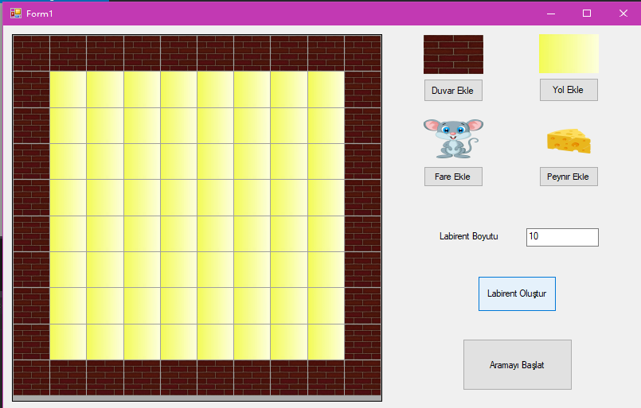
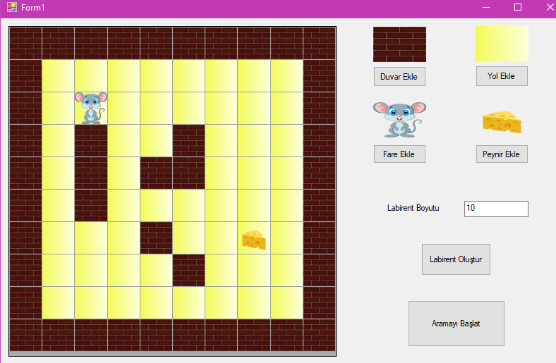
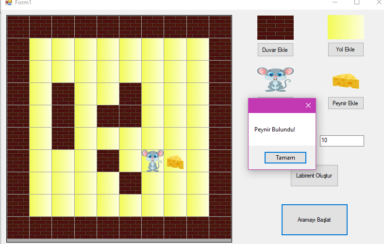

# FarePeynirOyunu

<h2> Projenin Amacı </h2>

 DataGrid ile oluşturulmuş alanda kullanıcın gireceği labirent boyutu kadar labirent oluşturulup içine duvarlar, fare ve peynir koyularak farenin peyniri bulması amaçlanmıştır. 

<h2> Projenin Mantığı </h2>

<b> Labirent Ekleme:</b> Kullanıcı ilk olarak labirent boyunu girer. Daha sonra “Labirent Oluştur” butonuna tıklayarak labirent oluşturur.

<b> Duvar Ekleme:</b> Kullanıcı labirent oluşturduktan sonra labirente “Duvar Ekle” butonuna tıklayarak labirentte istediği yere tıklayıp duvar ekleyebilir.

<b> Fare ve Peynir Ekleme:</b> Kullanıcı fare eklemek için “Fare Ekle” butonuna tıklayıp labirentte istediği yere tıklayarak fare ekleyebilir. Aynı şekilde “Peynir Ekle” butonuna tıklayarak istediği yere peynir ekleyebilir. Eklenmesi yasak bölgelere tıkladığında kullanıcı hata mesajıyla karşılaşır.

<b> Yol Ekleme:</b> Kullanıcı eklediği duvar, fare veya peynirin yerini değiştirmek isteyip veya onların yerine yol koymak istediğinde “Yol Ekle” butonuna tıklayıp istediği yere tıklayarak yol ekleyebilir.

<h2> Ekran Görüntüleri </h2>

